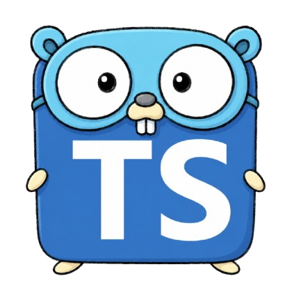

# typescript-as-go

An agent skill that teaches coding agents to write TypeScript as if it were Go:

- Simple
- Explicit
- No magic


## Usage

Install the skill:

```bash
npx skills add revett/typescript-as-go
```

This installs into the current project and works with Claude Code, Cursor, Cline, and 75+ other
agents. Add `-g` to install it globally, and run `npx skills update` to pull the latest version.

Then add the following to your `AGENTS.md`:

```md
## Code Style

It is critically important that you abide by all the rules set out in the
`typescript-as-go` skill when writing Typescript, no exceptions.
```

## Why

I wrote Go (by hand) for ~10 years before LLMs arrived and found it easy to follow due to how
restricted it is as a language. By design it is boring, as there are such few ways to implement
something.

Contrasting that with Typescript, it is a language that allows for a far greater amount of magic,
which makes reading code slower for me personally. Given that reading and reviewing code is now of
far greater importance, my theory is that simpler code that achieves the same desired outcome, is a
good thing.

## Acknowledgements

- Thanks to the writers of [Effective Go](https://go.dev/doc/effective_go)
